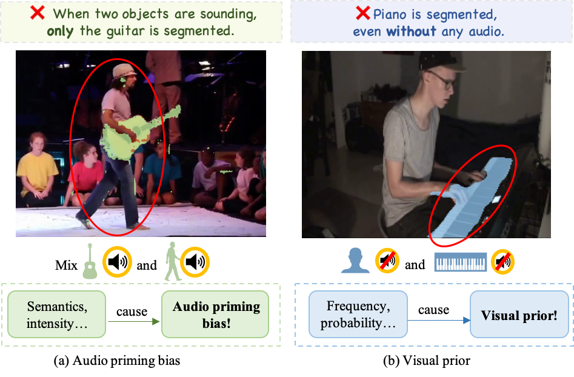

# 💬 bias_in_AVS
Official repository for "Unveiling and Mitigating Bias in Audio Visual Segmentation" in ACM MM 2024.

**Paper Title: "Unveiling and Mitigating Bias in Audio Visual Segmentation"**

**Authors: [Peiwen Sun](https://peiwensun2000.github.io), [Honggang Zhang](https://teacher.bupt.edu.cn/zhanghonggang/en/index/40466/list/) and [Di Hu](https://dtaoo.github.io/index.html)**

**Accepted by: The 32nd ACM International Conference on Multimedia (ACM MM 2024)**

🚀: Project page here: [Project Page](https://gewu-lab.github.io/bias_in_AVS/)

📄: Paper here: [Paper](https://arxiv.org/abs/2407.16638)

🔍: Supplementary material: [Supplementary](https://arxiv.org/abs/2407.16638)
## Abstract
ACommunity researchers have developed a range of advanced audio-visual segmentation models aimed at improving the quality of sounding objects' masks. While masks created by these models may **initially appear plausible**, they occasionally exhibit anomalies with **incorrect grounding logic**. We attribute this to real-world inherent preferences and distributions as a simpler signal for learning than the complex audio-visual grounding, which leads to the disregard of important modality information. Generally, the anomalous phenomena are often complex and cannot be directly observed systematically. In this study, we made a pioneering effort with the proper synthetic data to categorize and analyze phenomena as two types **“audio priming bias”** and **“visual prior”** according to the source of anomalies. For audio priming bias, to enhance audio sensitivity to different intensities and semantics, a perception module specifically for audio perceives the latent semantic information and incorporates information into a limited set of queries, namely active queries. Moreover, the interaction mechanism related to such active queries in the transformer decoder is customized to adapt to the need for interaction regulating among audio semantics. For visual prior, multiple contrastive training strategies are explored to optimize the model by incorporating a biased branch, without even changing the structure of the model. During experiments, observation demonstrates the presence and the impact that has been produced by the biases of the existing model. Finally, through experimental evaluation of AVS benchmarks, we demonstrate the effectiveness of our methods in handling both types of biases, achieving competitive performance across all three subsets. [Page](https://gewu-lab.github.io/bias\_in\_AVS/)

<p align="center">
  
</p>

## Code instruction

The overall training pipeline follows the list below.

1. Data Preparation
    * Prepare the training data
    * Download the pretrained ckpt
    * (Optional) Download the well-trained ckpt for finetuning
2. Audio pretransform
    * Audio clustering follows the HuBERT clustering pipeline in [github](https://github.com/bshall/hubert)
    * Audio classification follows the BETAS pipeline in [github](https://github.com/microsoft/unilm/tree/master/beats)
    * Save the cluster or class information in `pth`
3. (Optional) When training AVSS dataset, we gradually add `v1s, v2, v1m` in the data pool. It brings minor benefits to the performance of a curriculum training strategy.
4. Training the model with the debias strategy.
5. Evaluating on AVS Benchmark.


### Data Preparation

Please refer to the link [AVSBenchmark](https://github.com/OpenNLPLab/AVSBench) to download the datasets. You can put the data under `data` folder or rename your own folder. Remember to modify the path in config files. The `data` directory is as below:
```
|--data
 |--v2
 |--v1m
 |--v1s
 |--metadata.csv
```
Note: v1s is also known as S4, and v1m is also known as MS3. The AVSBench benchmark is strictly followed.

We use Mask2Former model with Swin-B pre-trained on ADE20k as the backbone, which can be downloaded in this [link](https://huggingface.co/facebook/mask2former-swin-base-ade-semantic) from [repo](https://github.com/facebookresearch/Mask2Former/blob/main/MODEL_ZOO.md). Don't forget to modify the `placeholder` in python files to your own path.

Our well trained model can be downloaded in this [link](https://drive.google.com/drive/folders/16IkrIQGQS9yfdXso_8y-GXZ7qwtLFKC7?usp=share_link). Don't forget to modify the `placeholder` in Python files to your own path.

### Audio pretransform

Before everything, if you want to set all queries as active queries, simply use `torch.ones` in [here](https://github.com/GeWu-Lab/bias_in_AVS/blob/main/AVSS/models/avs_model.py#L105). And then skip the audio pretransform below.

   Audio clustering follows the HuBERT clustering pipeline in [github](https://github.com/bshall/hubert)
   Audio classification follows the BETAS pipeline in [github](https://github.com/microsoft/unilm/tree/master/beats)
   Save the cluster or class information in `pth`
   As an example,
   ```
   |--preprocess/classification_avs/threshold_0.4
      |--V9JdDs7RK3c_1.pth
         |-- torch.Tensor(7, 21)
      |--...

   |--preprocess/classification_avs/threshold_0.4
      |--A7N2Japi3-A_5.pth
         |-- torch.Tensor(7, 45, 51)
      |--...
   ```
   We encourage the researchers to extract the clustering and classification information.

### Training

Note: Replace all placeholders with your own paths.

For S4 and MS3 subtasks, you can simply modify config in python files and replace the `pth` path of pre-transform of clustering or classification:  
~~~shell
cd AVS
sh run_avs_m2f.sh # for training
sh run_avs_m2f_test.sh # for testing
~~~
For AVSS subtask, the procedure is basically the same,
~~~shell
cd AVSS
sh run.sh # for training
# sh run_test.sh # for testing you can simply comment out the training part of the code
~~~

**Note**: Before getting into debias strategy, the vanilla model needs to reach adequate performance instead of from pure scratch.

### Testing
Normally, just like the former works, test can be done during training. However, we still are able to make small changes on the training code. For example, comment out the training part and the remaining part is just testing.


### Download checkpoints

We also provide pre-trained models for all three subtasks. You can download them from the [following links]().

### A few discussions and tips for experiments

1. The contrastive debias strategy requires SMALLER learning rate than the original learning rate to reach adequate performance.
2. Since the active queries requires the clustering and classification depended on the dataset distribution, we have tested the unseen performance on AVS-V3 in GAVS, which is proven limited.
3. The debias strategy costs nearly 2x FLOPs and 1.5x training time. However, the bias it deals with still worth it.

## Citation
If you find this work useful, please consider citing it.

~~~BibTeX
@article{sun2024unveiling,
  title={Unveiling and Mitigating Bias in Audio Visual Segmentation},
  author={Sun, Peiwen and Zhang, Honggang and Hu, Di},
  journal={arXiv preprint arXiv:2407.16638},
  year={2024}
}
~~~


## FAQ
The frequently asked questions through E-mail are updated here.

1. Why assign $C$ classes and $1$ cluster in Semantic-aware Active Queries?
    1. The original audio tends to be multisourced in MS3 and AVSS.
    2. The original clustering implementation in HuBERT assigns a single cluster to each time slot. This presents a problem of how to ensemble the clusters, and approaches such as voting and temporal pooling have been explored. However, in experiments, the behavior of assigning multiple clusters per audio seems strange and unstable. Personally, if the underlying clustering is more robust, the performance can be more stable.
2. The code of the classification and clustering?
    1. Since this framework is rather simple and straightfoward, the original implemetation of mine is implemented though `Jupyter`. Due to the relatively chaotic management of the memory pool and execution order of the Jupyter scripts, and I believe this is relatively easy to implement. So we encourage the community to implement it independently, and the subsequent loading only needs to maintain a consistent format.

Apologies for some hard code in this repo. I will keep updating if necessary.

## Thanks

* Part of the code is adapted from transformers
* Part of the code is adapted from GAVS by Yaoting Wang
